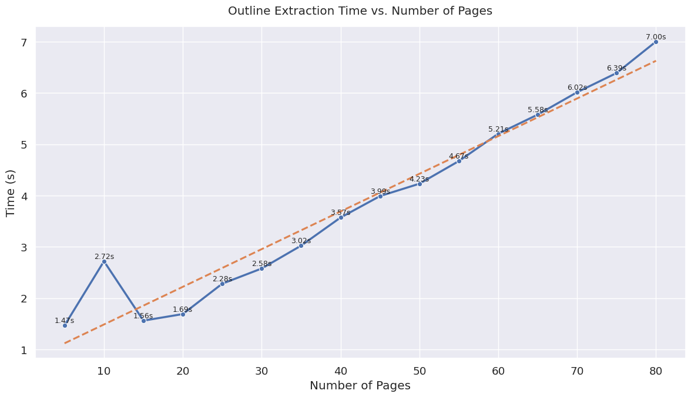
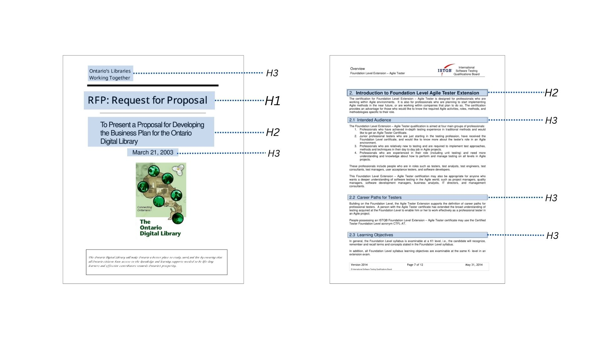

# Anton1A : PDF Outline Extractor

A friendly Python tool that turns your PDFs into clean, structured JSON outlines, perfect for RAG applications and programmatic use.

---

## Why Anton1A?

- **Fast & Accurate**: Leverages PyMuPDF and the specialized `pymupdf4llm` library for robust text extraction.
- **LaTeX Corruption Resilient**: Even with corrupted LaTeX it works really well - see the image below showing accurate extraction from a document with corrupt LaTeX formatting.
- **LLM-Powered Parsing**: Custom parsing logic built on top of LLM-generated Markdown converts complex PDF layouts into clear, hierarchical headings.
- **Rich Feature Set**: Batch processing, CLI and API interfaces, automatic output directory management, and multi-level heading support.

### Performance Benchmarks

Here are benchmark results showing the number of PDF pages vs the time it took to extract outlines and create JSON:



### Outline Highlights

This shows how it accurately highlights different PDF headings even with corrupted LaTeX formatting:


---

## Key Features

- **Extract Titles & Outlines**: Automatically detect the document title and hierarchical headings (H1, H2, H3).
- **Clean Text Output**: Normalizes punctuation, trims whitespace, and ensures consistent formatting.
- **CLI & Programmatic API**: Use it from your terminal or import and call `extract_outline_from_pdf` directly in Python.
- **JSON Output**: Easily integrate with other tools or workflows that consume JSON.
- **Batch Mode**: Process entire directories of PDFs in one command, with automatic output organization using `python llm4_to_json.py --all`.


---

## Installation

1. **Clone the repository:**
   ```bash
   git clone https://github.com/Prtm2110/AntonPDF-1A.git
   cd AntonPDF-1A
   ```

2. **Install dependencies:**

   ```bash
   pip install -r requirements.txt
   ```

---

## Requirements

* Python 3.10 or newer
* [PyMuPDF](https://pypi.org/project/PyMuPDF/)
* [pymupdf4llm](https://pypi.org/project/pymupdf4llm/)

---

## Quick Start

### Command Line Interface

* **Process one PDF and print to console**:

  ```bash
  python llm4_to_json.py path/to/document.pdf
  ```

* **Save to a named JSON file**:

  ```bash
  python llm4_to_json.py -o outline.json "My Document With Spaces.pdf"
  ```

* **Batch process all PDFs in `input/`**:

  ```bash
  python llm4_to_json.py --all
  ```

  This will read every PDF in `input/` and write output files to `output/`.

---

### Python API

```python
from llm4_to_json import extract_outline_from_pdf

result = extract_outline_from_pdf("path/to/my_doc.pdf")
print("Title:", result["title"])
for item in result["outline"]:
    print(f"Page {item['page']}: {item['level']} - {item['text']}")
```

---

### Docker Usage

* **Build the Docker image**:

  ```bash
  docker build --platform linux/amd64 -t Anton1A:somerandomidentifier .
  ```

* **Run with Docker**:

  ```bash
  docker run --rm -v $(pwd)/input:/app/input -v $(pwd)/output:/app/output --network none Anton1A:somerandomidentifier
  ```

---

## Output Format

```json
{
  "title": "Document Title",
  "outline": [
    { "level": "H1", "text": "Chapter 1: Introduction", "page": 1 },
    { "level": "H2", "text": "Background", "page": 2 }
  ]
}
```

---

## Command-Line Options

* `-a, --all`         : Process all PDFs in the `input/` folder and output to `output/`
* `-o, --output FILE` : Write JSON to `FILE` instead of printing to stdout
* `pdf_path`          : Path to the PDF file (supports spaces without additional quoting)

---

## Examples

1. **Single PDF to stdout**:

   ```bash
   python llm4_to_json.py input/1.pdf
   ```

2. **Single PDF to file**:

   ```bash
   python llm4_to_json.py -o my_outline.json input/2.pdf
   ```

3. **Batch mode**:

   ```bash
   python llm4_to_json.py --all
   ```

---

## License

MIT License. Feel free to modify and adapt this tool for your own projects.

---

## Contributing

Contributions, issues, and feature requests are welcome! Please open an issue or submit a pull request on GitHub.

*Happy outlining!*

